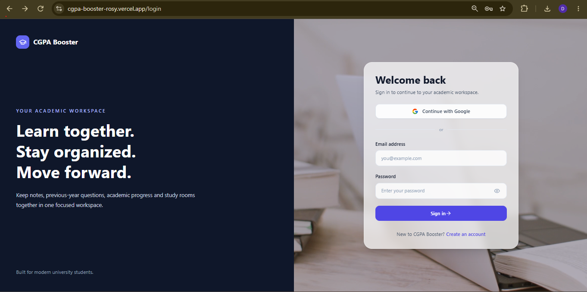
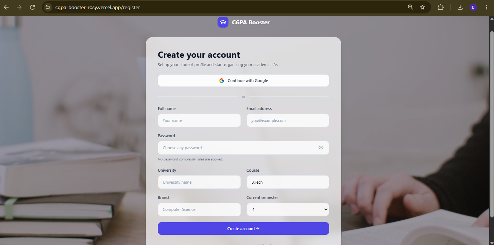
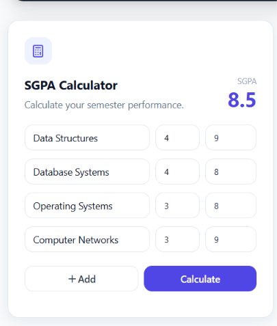
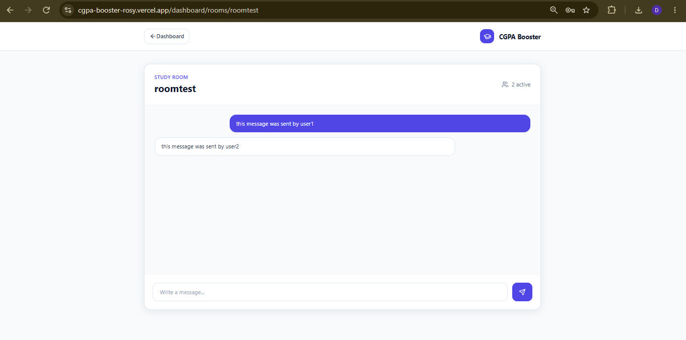
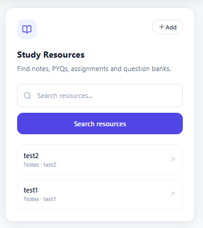
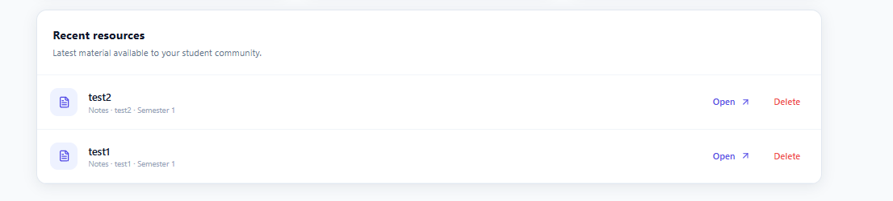

# CGPA Booster

A web app for college students. You can calculate your SGPA/CGPA, upload and share notes and previous year questions, and chat with friends in live study rooms.

Live: https://cgpa-booster-rosy.vercel.app

The backend is on Render's free tier, so it goes to sleep when nobody is using it. If the site feels stuck on first load, wait 30-50 seconds and it will wake up.

## What it does

- Calculates SGPA and CGPA using credits and grade points
- Lets you upload notes, PYQs and assignments, and search through them. Only the person who uploaded a file can delete it
- Study rooms with live chat, and you can see how many people are in the room
- Login with email and password, or with Google

## Screenshots

| Login | Register |
|---|---|
|  |  |

| SGPA Calculator | Study Room |
|---|---|
|  |  |

| Study Resources | Recent Resources |
|---|---|
|  |  |

## Built with

- Frontend: React, Vite, Redux Toolkit, Tailwind CSS
- Backend: Node.js, Express, MongoDB (Mongoose), Socket.io
- Auth: JWT, bcrypt, Passport (Google OAuth)
- Files: Multer + Cloudinary
- Hosting: Vercel (frontend), Render (backend), MongoDB Atlas

## A few things I ran into

- The production bundle came out at 417 KB (135 KB gzipped), and I fixed around 47 accessibility issues along the way.
- File upload showed a CORS error in the browser, but the real problem was the server crashing with a 502. The logs on Render showed it, the browser console did not.
- Google login worked but landed on a 404 page after redirecting. It needed a rewrite rule in `vercel.json` for the React routes.

## Run it locally

```bash
git clone https://github.com/deonarayankumar269-sketch/cgpa-booster.git
cd cgpa-booster
```

Create `server/.env`:

```
MONGO_URI=
JWT_SECRET=
JWT_EXPIRES_IN=7d
CLIENT_URL=http://localhost:5173
CLOUDINARY_CLOUD_NAME=
CLOUDINARY_API_KEY=
CLOUDINARY_API_SECRET=
GOOGLE_CLIENT_ID=
GOOGLE_CLIENT_SECRET=
GOOGLE_CALLBACK_URL=http://localhost:5000/api/auth/google/callback
```

Create `client/.env`:

```
VITE_API_URL=http://localhost:5000/api
VITE_SOCKET_URL=http://localhost:5000
```

Then run the server and client in two terminals:

```bash
cd server
npm install
npm run dev
```

```bash
cd client
npm install
npm run dev
```

Or use Docker: `docker-compose up --build`

## Author

Deonarayan Kumar. [LinkedIn](https://linkedin.com/in/deonarayan-kumar) | [GitHub](https://github.com/deonarayankumar269-sketch)